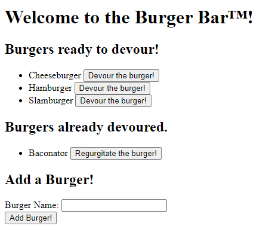

# Eat Da Burger
Minimal Express.js server utilizing express-handlebars to serve a website that interfaces with a basic MySQL database in order to store data about burgers.

## Technologies Used
- Node.js
- Express.js
- Express Handlebars
- MySQL

## Deployment
The website served by this app can be viewed [here](https://davidburger.herokuapp.com).

